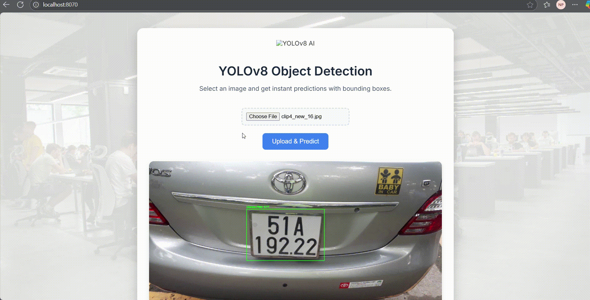

# License Plate Detection with FastAPI

This project includes a real-time License Plate Detection API built using FastAPI and YOLOv8. The API allows users to upload images and receive detection results with bounding boxes of license plates.

This project is a part of MLOps cource (CS317.P22), with members:
- Huynh La viet Toan: 22521486
- Nguyen Truong Minh Khoa: 22520680
- Nguyen Thanh Luan: 22520826
- Luong Truong Thinh: 22521412
- Phan Phuoc Loc Ngoc: 22520960

## How It Works

- Upload an image via web interface or POST request
- Automatically detects license plates using YOLOv8 model
- Returns annotated image and detection details
- Lightweight UI for image testing
- Ready to deploy via Docker and Docker Compose

## Requirements

- Python 3.10+
- Dependencies: ultralytics (for YOLOv8)
- Docker
- FastAPI

## Setup & Usage

1.  **Clone the Repository:**
    ```bash
    git clone https://github.com/locngocphan12/YOLOv8_LicensePlateDetection.git
    cd YOLOv8_LicensePlateDetection
    ```
    
2. **Running Docker containers:**
    ```bash
    docker-compose up -d
    ```
   
3. **Access the UI:**
    - Open your web browser and navigate to http://localhost:8070, upload images and receive detection results with bounding boxes of license plates.

## Demo

### API Inference Service with FastAPI



### Demo video link: 

## Note
- To see full demo video, access this link: [here](https://drive.google.com/drive/folders/1yMuBndtiyRO6WYN8pirCCLKDye0cDYQ4?usp=sharing) 
- Feel free to check out this repository for a full MLOps pipeline through the link below: [here](https://github.com/locngocphan12/MLOPs-LicensePlateRecognition)

## Collaborators
<a href="https://github.com/luanntd">
  
</a>
<a href="https://github.com/Khoa-Nguyen-Truong">
  
</a>
<a href="https://github.com/HuynhToan2004">
  
</a>
<a href="https://github.com/locngocphan12">
  
</a>
<a href="https://github.com/thinhlt04">
  
</a>

<p align="right">(<a href="#readme-top">back to top</a>)</p>